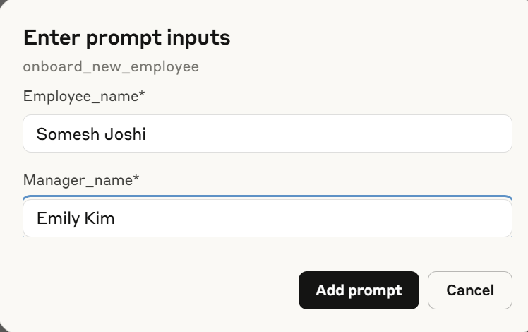
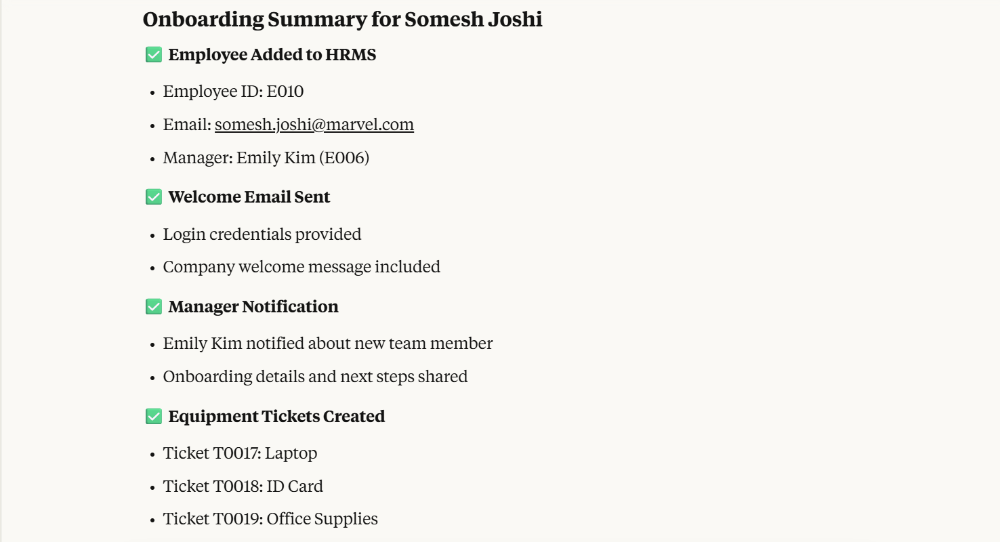
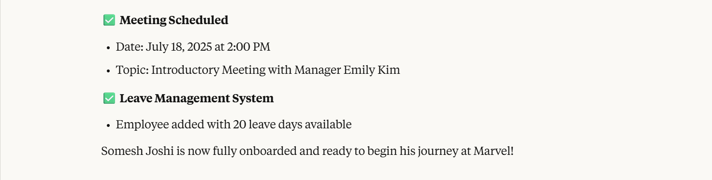
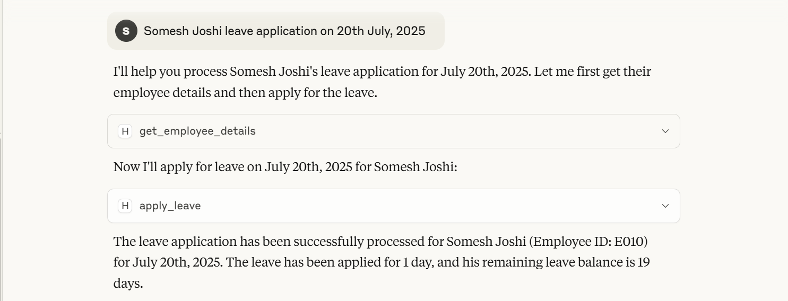

# Marvel HR Assist


A smart HR assistant toolkit that streamlines everyday human‑resource workflows, automates routine requests, and keeps employee information at your fingertips. **Marvel HR Assist** is built entirely in Python with no external database – perfect for rapid prototyping, internal bots, demos, and small teams.

---

## ✨ Key Features

| Module | What it does |
| ------ | ------------ |
| **Employee Manager** | Create, update, search, and report on employees, managers, and org structure. |
| **Leave Manager** | Track leave balances, apply for leave, and retrieve leave history with sensible defaults. |
| **Meeting Manager** | Schedule, list, and cancel employee meetings with ISO‑8601 date support. |
| **Ticket Manager** | Lightweight IT/office ticketing (open → closed) with automatic ticket‑ID generation. |
| **Email Sender** | Utility for SMTP mail‑outs that supports attachments and `.env` secrets. |
| **Pydantic Schemas** | Strongly‑typed request/response models for validation and editor autocompletion. |

---

## 🗂️ Project Layout

```
marvel-hr-assist/
├── hrms/                  # Core package
│   ├── employee_manager.py
│   ├── leave_manager.py
│   ├── meeting_manager.py
│   ├── ticket_manager.py
│   └── schemas.py
├── emails.py              # SMTP helper
├── Resources/             # Example assets (images, etc.)
├── pyproject.toml         # Build & dependency metadata
└── README.md
```

---

## 🚀 Quick Start

> Requires **Python 3.10+**.

```bash
# 1. Clone and enter the repo
git clone https://github.com/your‑org/marvel‑hr‑assist.git
cd marvel-hr-assist

# 2. (Recommended) Create a virtual environment
python -m venv .venv
source .venv/bin/activate           # Windows: .venv\Scripts\activate

# 3. Install package and dependencies
pip install .
```

## 🖼️ Screenshots

These images demonstrate sample resources used within the Marvel HR Assist project:

|  |  |
|-----------------------------|-----------------------------|
|  |  |

### Code Example

```python
from hrms import employee_manager, leave_manager, meeting_manager, ticket_manager
from hrms.schemas import EmployeeCreate, LeaveApplyRequest

# Employees
em = employee_manager.EmployeeManager()
em.add_employee(EmployeeCreate(name="Tony Stark"))
em.add_employee(EmployeeCreate(name="Peter Parker", manager_id="E001"))
print(em.get_direct_reports("E001"))

# Leave
lm = leave_manager.LeaveManager()
print(lm.apply_leave(LeaveApplyRequest(emp_id="E002", leave_dates=["2025‑07‑16"])))

# Meeting
mm = meeting_manager.MeetingManager()
mm.schedule_meeting(meeting_manager.MeetingCreate(emp_id="E001",
                                                  meeting_dt="2025‑07‑20T09:00:00",
                                                  topic="Strategy session"))
```

---

## 📧 Email Sender

Save your credentials in a `.env` file:

```
EMAIL=you@example.com
EMAIL_PWD=your‑app‑password
```

Then:

```python
from emails import EmailSender

sender = EmailSender("smtp.gmail.com", 587,
                     username=os.getenv("EMAIL"),
                     password=os.getenv("EMAIL_PWD"),
                     use_tls=True)
sender.send_email(
    subject="Welcome!",
    body="Glad to have you aboard.",
    to_emails="new.employee@example.com"
)
```

---

## 🧪 Running Tests

```bash
pytest
```

*(Add tests under `tests/` – see `examples/` for sample scenarios.)*

---

## 📦 Packaging & Release

The project is **PEP 621** compliant. Build wheels or source dists with:

```bash
python -m build
```

Publish to PyPI (requires `twine`):

```bash
twine upload dist/*
```

---

## 🤝 Contributing

1. Fork the repo and create your feature branch (`git checkout -b feature/foo`).
2. Commit your changes (`git commit -am 'Add amazing feature'`).
3. Push to the branch (`git push origin feature/foo`).
4. Open a Pull Request.

Please adhere to the existing code style and include tests for any new behaviour.

---

## 📄 License

This project is distributed under the **MIT License** – see the [LICENSE](LICENSE) file for full text.

---

## 👋 Contact

**Somesh Joshi**  
<joshi.somesh1996@gmail.com>

Feel free to reach out with questions, ideas, or contributions!
